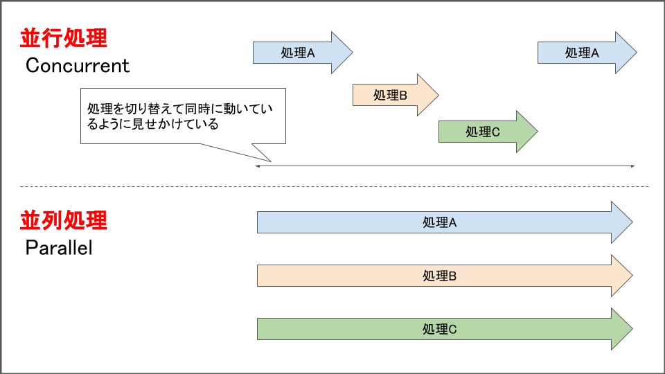

Pythonで複数ファイルに対して同じ操作をしたいときに，
1つずつ開いて操作をしていると遅いので，  
並列化して高速化することを目論む．
本ページでは雛形を提示する．

## 並行処理と並列処理

英語では以下のように表現する．

- 並行処理: Concurrency
- 並列処理: Parallel

細かい話は他の文献に譲るとして，簡単に説明すると

- 並行処理は，ある時間の範囲内で複数の処理を行うこと．
- 並列処理は，ある時間の範囲内で同時に処理を行うこと．

並行処理は同じ時間に1つの仕事しかしないが，各処理をちょっとずつ進めたり，一方の処理の待ち時間でCPUが空いてるときに他方の処理をするなどして高速化する．つまり，効率的に処理を切り替えることで高速化する．

並列処理は同じ時間に複数の作業を同時に行うことで高速化する．

並行処理は無駄をなくす，並列処理は道路を増やすという方法で高速化する．

図で示すと以下のようなイメージ．


> (<https://blog.framinal.life/entry/2020/04/05/204055>)より引用

## スレッドとプロセス

プロセスはプログラム1つの実行単位．  
スレッドはプロセスの中の実行単位．  
プロセスの中に複数のスレッドが存在する．  
つまり，CPUコアの実行単位はスレッドになる．

スレッドはプロセス内の同じメモリ空間を共有できるが，
プロセスではプロセスごとにメモリ空間が確保されるため，
データを共有するにはプロセス間通信を行う必要がある．

PythonではGILがあるので，CPUバウンド(高負荷な処理)をスレッドで高速化すること
は困難である．
つまり，

- I/Oバウンドな処理はマルチスレッド
- CPUバウンドな処理はマルチプロセス

で実装するのが良い．

## Pythonでの実装

Pythonで並列・並行処理を実装するには以下の方法(標準ライブラリ)がある．

- 並行処理
  - threading
  - concurrent.futures
- 並列処理
  - multiprocessing
  - concurrent.futures

`concurrent.futures`はPython3.2から追加されたthreadingやmultiprocessingのラッパー．  
コードが簡単になるのでとりあえずこれを使う．

前述の通り，PythonのGILによってスレッド周りでの高速化はあまり期待できないので，
並列処理でマルチプロセスしたほうが早くなる場合が多い．

## 並列処理のコード例

2022.07.05 更新: ソースコード例に重大な誤りがありました．お詫びいたします．

下記の例はマルチプロセスの例である．マルチスレッドにする際は，
`ProcessPoolExecutor`を`ThreadPoolExecutor`に変更すれば良い．

下記の関数fnがI/Oバウンドならマルチスレッドを，
CPUバウンドならマルチプロセスにすれば良い．

```python
from concurrent.futures import ProcessPoolExecutor
from tqdm import tqdm
import os
import time


def fn(idx, d):  # -------------------(1)
    # for文の1つ単位の処理を関数化する
    time.sleep(0.1)
    return idx, d


def fn2(d):  # -------------------(1)
    # for文の1つ単位の処理を関数化する
    time.sleep(0.1)
    return d


def main():
    data = list(range(1000))

    # tqdmで経過が知りたい時
    with tqdm(total=len(data)) as progress:
        # 1. 引数にiterできないオブジェクトがある時
        with ProcessPoolExecutor(max_workers=os.cpu_count() // 2) as executor:  # -----(2)
            futures = []  # 処理結果を保存するlist
            for i, d in enumerate(data):  # -------(3)
                future = executor.submit(fn, i, d)
                future.add_done_callback(lambda p: progress.update()) # tqdmで経過が知りたい時
                futures.append(future)
            result = [f.result() for f in futures]

    # 2. 引数がiterできる場合
    with ProcessPoolExecutor(max_workers=os.cpu_count() // 2) as executor:  # -----(2)
        result = list(tqdm(executor.map(fn2, data), total=len(data)))


if __name__ == "__main__":
    main()
```

tqdmで経過を確認できるようにした．

1. 並列化したい処理の範囲を関数に書き出す  
((1)のfn関数, 引数が1つのみでdataのように配列の要素を次々渡すときは(2)のfn2関数)
1. `with ProcessPoolExecutor(max_workers=worker_num) as executor:`内でexecutorに関数とその引数を`submit or map`で渡す．

2について，関数の引数がiter可能な場合はmapを使えば(3)のforを省略できる．

## 参考

[$card](https://qiita.com/tag1216/items/db5adcf1ddcb67cfefc8)

[$card](https://qiita.com/ttiger55/items/5e1d5a3405d2b3ef8f40)

[$card](https://zenn.dev/ryo_kawamata/articles/python-concurrent-thread)
