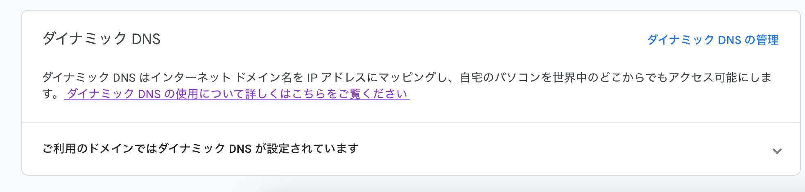

今回は，Google Domains の DDNS を使ってドメインに動的に ip アドレスを振る方法を書く．

## DDNS とは

DDNS は Dynamic DNS の略で，ドメインに割り当てられたホストの IP アドレスに変更があった場合に DNS サーバに通知を行って，ドメインの IP を変更するサービスのことである．

通常の光回線契約では，HGW ルータの電源を入れ直す度に新しいグローバル IP が付与されることが多い．その場合，ドメインに紐づけられた IP を都度変更しなければならない．もちろん固定 IP の契約もできるが料金がかかるため，小規模な自宅サーバなら DDNS を利用したほうが低コストで常時自宅サーバにドメイン名でアクセスできる．

## Google Domains

Google Domains では DDNS が利用でき，サーバ側で`ddclient`を使えば簡単に DDNS を利用できる．
取得方法は Google のことなので，仕様変更が多々あると思うので，公式を参考に．

## ddclient

```bash
apt install ddclient
```

インストールの際，GUI で色々聞かれますが，後から設定ファイルで設定するので適当に埋めていく．

設定例は以下．場所は`/etc/ddclient.conf`

```bash
# /etc/ddclient.conf
daemon=60 # サービス化して定期実行する感覚

ssl=yes
protocol=googledomains
use=web
login=[Google Domainsで取得]
password=[Google Domainsで取得]
hoge.hoge.com # DDNSを設定するドメイン
```

Google Domains で取得する場所はここ．



ここから認証情報を取得して設定する．

さらに，DDNS をサービス化して定期実行する場合は`/etc/default/ddclient`を編集する．

```diff
# /etc/default/ddclient

- run_daemon="false"
+ run_daemon="true"

```

これであとはサービスに登録すれば OK．

手動実行する場合は以下を実行する．

```bash
sudo ddclient -daemon=0 -verbose
```

## 参考

<https://qiita.com/gorohash/items/8287738ffe47ab52a36f>
<https://www.uchidigi.com/2020/01/ddclient-google-ddns.html>
