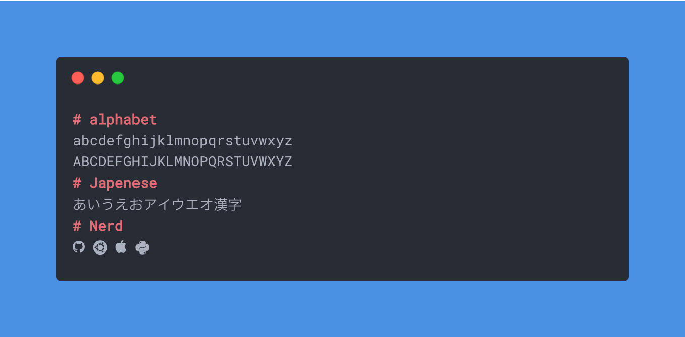

こんにちは．今回は自作したフォントについて紹介します．

普段，ターミナルやエディタのフォントは，GoogleFontで配布されているRobotoMonoを使用しているのですが，
このフォントには日本語文字が含まれていません．  
そのため，日本語を入力すると豆腐になってしまったり，OSのデフォルトフォントになってしまったりします．  
そこで，FontForgeを使って日本語フォントを合成して一つのフォントですべてをまかなえるようにしました．

合成したフォントは以下です．

- [RobotoMono](https://fonts.google.com/specimen/Roboto+Mono)
- [IBM plex Sans JP](https://github.com/IBM/plex)
- [Nerd Font](https://github.com/ryanoasis/nerd-fonts)

どれもオープンソースで公開されているので，自由に改変することができます．  
NerdFontは各種アイコンをフォントに埋め込むことができるもので，ターミナルのシェルをPowerlineなどにしている場合は，使っている人も多いと思います．

フォントの見た目は以下のようになっています．

ダウンロードは私のGithubリポジトリから行うことができます．

<https://github.com/mjun0812/RobotoMonoJP>

あまりフォントに詳しくないため，不備があるかもしれません．ご了承ください．  
ソースコードも添付しているので，改変する方はそちらを読んでみてください．  
ライセンスもオープンにしています．
