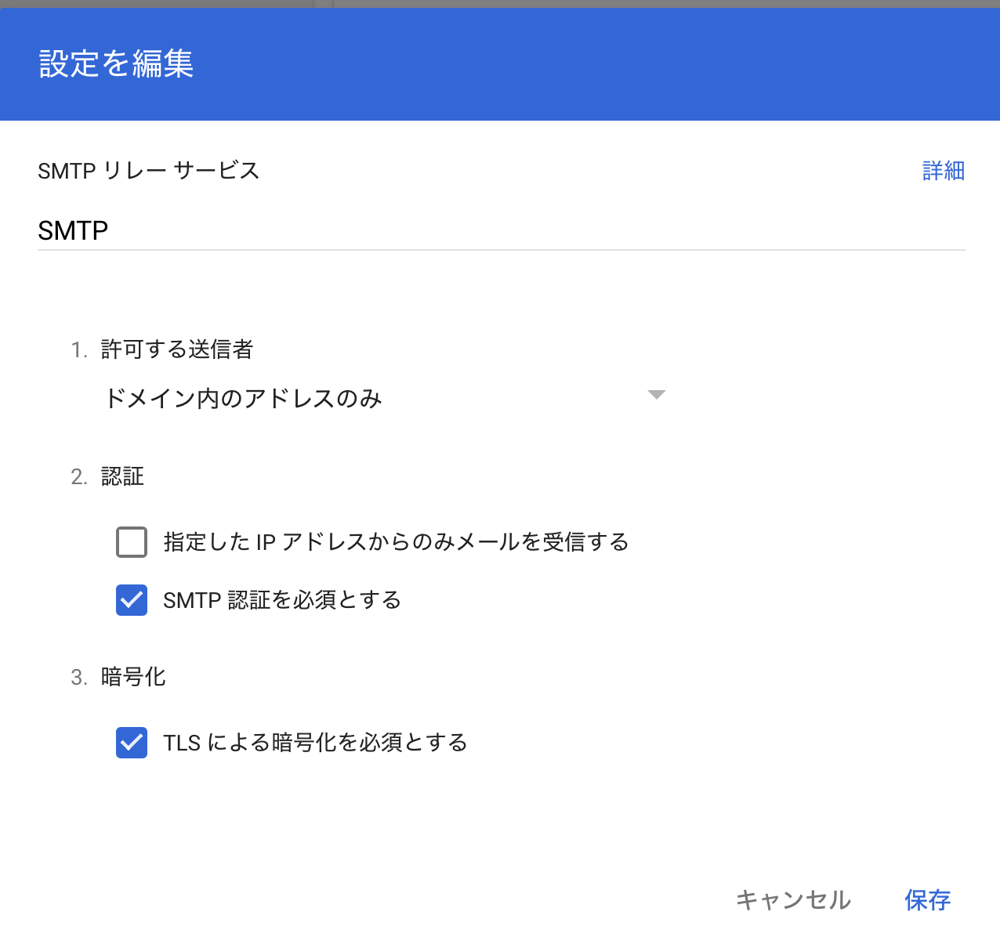
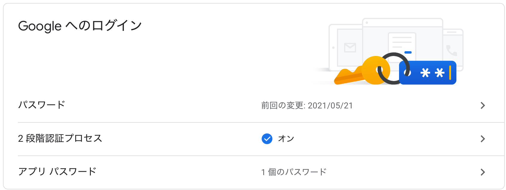

私はクレデンシャルなソースコードを管理するために，自宅サーバでGitLabをセルフホストしています．  
基本的にユーザーは自分しかいないのですが，メール通知があったほうが便利かと思い，メールを設定することにしました．

ちょうど，このサイトのドメインを使ってGoogle Workspaceを契約しているので，提供されているSMTPリレーサービスを使って，
Google経由でメール通知を行うことにします．

## OP25B問題について

自宅サーバーでメールの送信を行うのに問題になるのが「OP25B」です．  

<https://www.ntt.com/personal/services/option/mail/ocnmail/meiwaku/op25b.html>

これは迷惑メール対策のために，プロバイダーが自宅からのメール送信をブロックしてしまう問題です．  
これを回避するためにプロバイダが用意しているSMTPリレーサーバを中継してメールを送信するのですが，
そもそもSMTPサーバが提供されていなかったり，制限があることがあります．  
そこで，今回は独自ドメイン内なら制限の緩い，Google WorkspaceのSMTPリレーサービスを使うことにします．

## Google Workspaceの設定

まずは，Google Workspaceの管理コンソールへ行きます．

<https://support.google.com/a/answer/2956491?hl=ja>

上記のサイトに書かれているように，
管理コンソールから、アプリ->Google Workspace->Gmail->ルーティングと進み，SMTPリレーサービスの設定画面を開きます．



上記のように，

- ドメイン内のアドレスのみ
- SMTP認証を必須とする
- TLSによる暗号化を有効にする

を設定します．

次に，Googleアカウントに2段階認証を設定している場合は，
アカウント設定で，アプリパスワードを発行します．



このアプリパスワードを使ってSMTP認証を行ってメールを送信します．

## GitLab docker-compose.ymlの設定

```yaml
version: '3.7'
services:
  gitlab:
    image: gitlab/gitlab-ce:14.7.2-ce.0
    restart: always
    hostname: 'hoge.com'
    environment:
      GITLAB_OMNIBUS_CONFIG: |
        external_url 'http://hoge.com'
        gitlab_rails['time_zone'] = 'Asia/Tokyo'

        # mail
        gitlab_rails['smtp_enable'] = true
        gitlab_rails['smtp_address'] = "smtp-relay.gmail.com"
        gitlab_rails['smtp_port'] = 587
        gitlab_rails['smtp_domain'] = [独自ドメイン or gmail.com]
        gitlab_rails['smtp_authentication'] = "login"
        gitlab_rails['smtp_user_name'] = [Googleアカウントのユーザー名]
        gitlab_rails['smtp_password'] = [Googleアカウントのパスワード or アプリパスワード]
        gitlab_rails['gitlab_email_from'] = 'gitlab@gmail.com'
        gitlab_rails['gitlab_email_reply_to'] = 'noreply@gmail.com'
    ports:
      - '80:80'
      - '22:22'
    volumes:
      - ./gitlab/data:/var/opt/gitlab
      - ./gitlab/logs:/var/log/gitlab
      - ./gitlab/config:/etc/gitlab
```

上記のように，docker-compose.yamlを編集して，起動すれば設定は以上です．

メールの送信ができているかは，GitLabアカウントのメールアドレス認証をやってみると良いです．

###  参考

<https://www.ntt.com/personal/services/option/mail/ocnmail/meiwaku/op25b.html>

<https://support.google.com/a/answer/2956491?hl=ja>

<https://docs.gitlab.com/omnibus/settings/smtp.html>