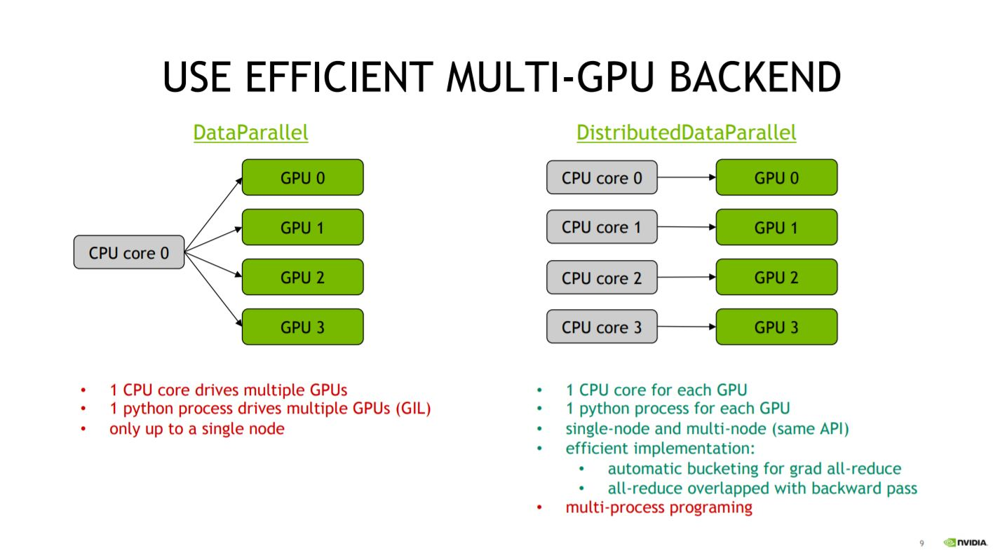

機械学習ライブラリの PyTorch には、複数のマシン・GPU で
学習を行う方法がいくつか用意されている。  
この記事を書いている現在、PyTorch の stable version は`1.11.0`であるが、
実行方法が、直近の version`1.9.0`と`1.10.0`で変更・追加があったのでまとめる。

## DataParallel と DistributedDataParallel

PyTorch で複数の GPU を用いた Training の実装方法は 2 つある。

1. `torch.nn.DataParallel`
2. `torch.nn.DistributedDataParallel`

この２つの違いは、複数の GPU に割り当てられるCPUコアが
全体で1つか各GPUに複数かである。



上記の図[^1]のように、Python の GIL の都合もあり、
`DistributedDataParallel`を使ったほうが各 GPU に個別の CPU コアを割り当てられるので、
リソースを存分に使うことができる。
また、複数のマシン(Multi-node)で実行できるのも強みである。
実際、公式ドキュメント[^2]でも`DistributedDataParallel`が勧められている。

ここまでくると、`DataParallel`のメリットが感じられないが、実装の違いを
見ると利点が見えてくる。

まず、`DataParallel`の実装は以下である。

```python
import torch

model = hoge()
+ model = torch.nn.DataParallel(model, device_ids=[0,1,2,3])
```

上記のように既存のモデル(`torch.nn.Model`)に対して、`torch.nn.DataParallel`をラップするだけで
実装でき、既存のコードを 1 行変更するだけで実装することができる。

次に、`DistributedDataParallel`の実装例を確認する。

```python
import os
import torch
import torch.distributed as dist
from torch.nn.parallel import DistributedDataParallel as DDP
from torch.utils.data.distributed import DistributedSampler

# どのGPUプロセス番号かがLocal Rank
# GPU ID = 1の時、local_rank=1
local_rank = os.getenv('LOCAL_RANK', 0)

# 通信方法の規定とプロセスグループの初期化
dist.init_process_group(backend='nccl', init_method='env://')

dataset = Dataset(hoge)

# DistributedSamplerを使う
sampler = DistributedSampler(dataset, rank=local_rank)
dataloaders = torch.utils.data.DataLoader(dataset,
                                          batch_size=16,
                                          sampler=Distributed)

# DistributedDataParallelでラップ
model = Model(fuga)
model = DDP(model)

# ...

# Training終了
dist.destroy_process_group()
```

`DistributedDataParallel`では、シングル・マルチマシンの場合も同じ書き方ができるように
設計されているため、新たに実装する部分が多い。
マルチプロセスになった分、自分が今どのプロセスにいるのかを意識しながら実装を進める必要がある。

上記の通り、`DataParallel`は 1 行で既存のコードを変更することができるが、
`DistributedDataParallel`は多少の追加実装が必要になる。
手軽に複数 GPU での Training を試したい場合は、`DataParallel`を用いるとよい。

次章では新たに追加された`torchrun`について議論するため、以下からは`DistributedDataParallel`
を用いた場合について考える。

## DistributedDataParallel の実行方法

DistributedDataParallel の実行方法は、大きく分けて以下の２つある。

1. 特定の関数について GPU 並列化を行う方法(`mp.spawn`)
2. スクリプトごと GPU 並列化する方法(`torchrun`, `torch.distributed.run`, `torch.distributed.launch`)

### 1. 関数について並列化

1 の関数ごとに並列化する方法は、コード内で Training を行う関数を書いて、使用する GPU の数や
通信方法もコード内で設定して実行することができる。
つまり、シングル GPU であっても、複数 GPU のコードであっても`python train.py`と、
同じコマンドの実行で学習が行える。  
実装例は PyTorch 公式の ImageNet 学習の実装に書かれている。

<https://github.com/pytorch/examples/tree/main/imagenet>

2 の方法と大きく異なる部分が、以下の部分である。

```python
import torch.multiprocessing as mp

def train(rank, hoge):
    dist.init_process_group(backend='nccl', init_method='env://')

def main():
    mp.spawn(train, nprocs=ngpus_per_node, args=(hoge))
```

上記の通り、コード自体は Python 標準モジュールの multiprocessing と変わりない。  
しかし、標準モジュールは CUDA Initialized を複数行ってしまい、エラーが発生するため、
multiprocessing モジュールをラップした、`torch.multiprocessing`を使用する。

### 2. スクリプトごと並列化

2 の方法については PyTorch のバージョンによって実行方法が異なっており、
version 1.9.0 以前は、  
`python -m torch.distributed.launch --nproc_per_node=4 --nnodes=1 --node_rank 0 train.py`  
で実行されていたが、version 1.9.0 以降は TorchElastic が追加された影響で  
`python -m torch.distributed.run --nproc_per_node=4 --nnodes=1 --node_rank 0 train.py`  
でも実行できる。  
また、`torch.distributed.launch`の super set として、`torchrun`が Version 1.10.0 から提供されている。

ここでは従来の方法である、`torch.distributed.launch`と`torch.distributed.run`について述べる。

`torch.distributed.launch`と`torch.distributed.run`の場合、
実行スクリプトの`train.py`にはコマンドライン引数として
`--local_rank`を受け取れるように実装する必要がある。下に例を示す。

```python
import argparse
parser = argparse.ArgumentParser()
parser.add_argument("--local_rank", type=int)
args = parser.parse_args()

local_rank = args.local_rank
```

これ以外の実装は 1 の関数ごとに multiprocessing する場合と変わらない。

### 1 と 2 の実行方法の違いについて

1 の関数を multiprocessing する方法と、スクリプト自体を multiprocessing する方法は、
[こちらの公式フォーラム](^3)
[^3]でも言及されているように、
`multiprocessing(1) vs subprocess(2)`の違いといえる。

Github の Issue[^4] [^5]では、1 の方法が GPU への転送速度の関係で遅いという報告もある。
長い時間の学習では無視できるようだが、参考としておきたい。

## 新しい実行方法 `torchrun`

PyTorch の Version 1.10.0 から、`torch.distributed.launch`の super set として、`torchrun`が登場している。

公式ドキュメント[^6]にわかりやすい移行手順があるので、一読をお勧めする。

具体的には、実行コマンドが以下のように変更され、

```bash
# use_envはLOCAL RANKをargparseではなく、
# 環境変数から受け取るオプション
python -m torch.distributed.launch --use_env train_script.py

torchrun train_script.py
```

argparse で受け取っていた local rank を環境変数から受け取るようになる。

```python
# torch.distributed.launch
import argparse
parser = argparse.ArgumentParser()
parser.add_argument("--local_rank", type=int)
args = parser.parse_args()

local_rank = args.local_rank

# torchrun
import os
local_rank = int(os.environ["LOCAL_RANK"])
```

ほとんど使用感は変わりないが、わざわざ argparse で引数の受取先を作らなくてよくなったのは、
コマンドライン引数の名前空間を汚されなくて済むので利点がある。  
例えば、Facebook 謹製の設定管理ライブラリの
[Hydra](https://hydra.cc/) [^7]を使っている場合、argparse と併用ができないので、
torchrun で環境変数を経由するメリットがある。  
(ただし、ここ[^8] [^9]で議論されているように、output 周りが conflict する問題があるので、
今後の動向に注目するべきである。)

ここ[^10]で、書かれているように`torch.distributed.launch`
は将来的に deprecated したいようなので、今後は torchrun で実装していくべきだろう。

## 参考

[^1]: https://qiita.com/sugulu_Ogawa_ISID/items/62f5f7adee083d96a587#4-multi-gpu%E3%81%AE%E8%A8%AD%E5%AE%9A
[^2]: https://pytorch.org/docs/1.11/notes/cuda.html#use-nn-parallel-distributeddataparallel-instead-of-multiprocessing-or-nn-dataparallel
[^3]: https://discuss.pytorch.org/t/torch-distributed-launch-vs-torch-multiprocessing-spawn/95738
[^4]: https://github.com/pytorch/pytorch/issues/47587
[^5]: https://github.com/NVIDIA/apex/issues/549
[^6]: https://pytorch.org/docs/1.11/elastic/run.html
[^7]: https://hydra.cc/
[^8]: https://github.com/facebookresearch/hydra/pull/2119
[^9]: https://github.com/facebookresearch/hydra/issues/2038
[^10]: https://pytorch.org/docs/1.11/distributed.html#launch-utility
