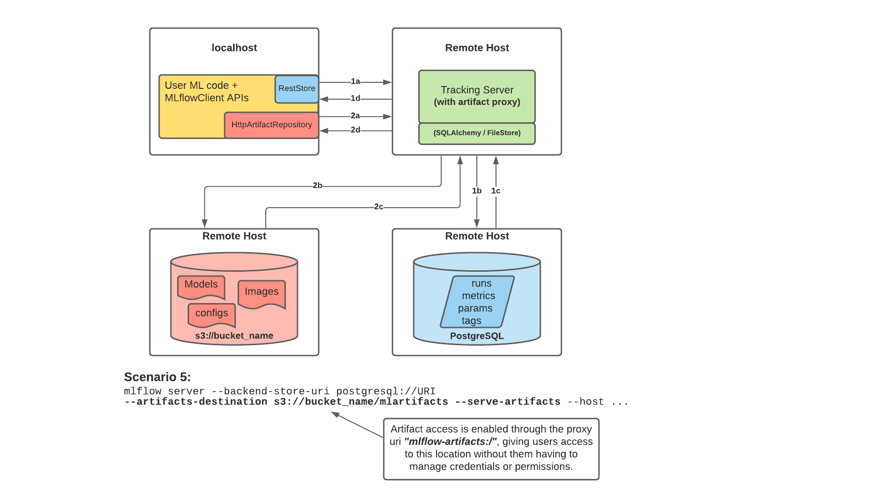
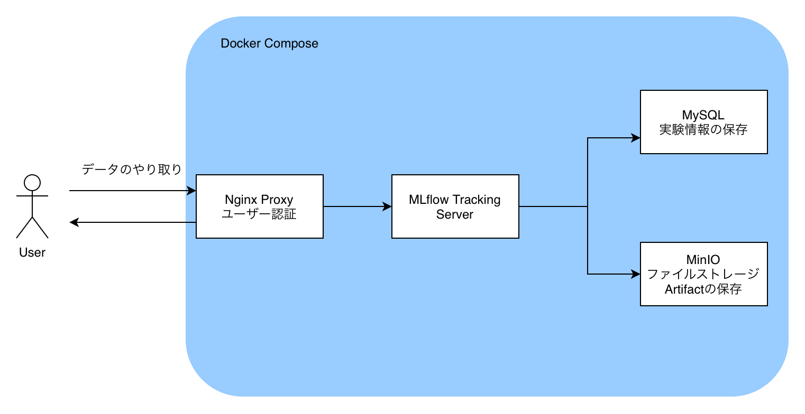

こんにちは．今回は実験管理ツールであるMLflowをオンプレミスで構築する方法についてご紹介します．

## 導入の動機

機械学習を扱っていると，ハイパーパラメータやモデル，データセットを変更しながら様々な実験を行うことになります．この際，結果の比較を効率的に行える実験管理ツールを導入することで，実験同士の比較をスムーズに行おうと考えました．

この手の実験管理ツールは，MLOpsが盛んな今，TensorboardやWeight & Bias(wandb)など，様々ありますが，最近は[MLflow](https://www.mlflow.org)が選択肢として大きく盛り上がっています．

しかし，様々ある実験管理ツールの中で，データの外部送信を行わずに扱える「オンプレミス」「自前サーバ」という点に着目すると選択肢はさほど多くなく，最も使われているであろうMLflowを構築してみようと思います．


## MLflowとは

Mlflowはオープンソースの機械学習のライフサイクル管理ツールで，
MLflow Tracking, Projects, Models, Registoryからなるモジュールに分かれています．

今回は主に実験管理を行うMLflow Tracking Serverをオンプレのサーバに建てる方法をまとめます．  
MLflow Trackingでは機械学習モデルのハイパーパラメータや精度，ログファイルをMLflow側で一括管理することができるので，実験同士の比較を簡単に行うことができます．

## 構成図

今回はDocker Composeを用いて，MLflow Tracking Serverを構築していきます．


> <https://mlflow.org/docs/latest/tracking.html#scenario-5-mlflow-tracking-server-enabled-with-proxied-artifact-storage-access> より引用

MLflowでは，実験の結果等の数値だけでなく，configファイルやソースコード，学習済みモデルファイル等のバイナリファイルもStoreすることができます．この際，バイナリファイルはartifactと呼ばれ，数値とは別の場所に保存されます．

今回は[MLflowのドキュメント](https://mlflow.org/docs/latest/tracking.html#scenario-5-mlflow-tracking-server-enabled-with-proxied-artifact-storage-access)にもあるように，実験のパラメータ等をMySQLのDBに保存し，artifactをDockerで立てたAWS S3互換のオブジェクトファイルストレージであるMinIOに保存していきます．

また，MLflowにユーザー認証をかけるためにDockerのnginx-proxyを用いて，Basic認証を導入します．



## Docker Compose

というわけで，Docker Composeで以下のコンテナを立てて構築していきます

- Nginx Proxy(jwilder/nginx-proxy)
- MLflow Tracking Server
- MySQL 8.0
- MinIO

実際に動かせるものは，こちらのGithubにあります．

<https://github.com/mjun0812/MLflow-Docker>

まず，MLflow Tracking ServerのDockerfileは以下です．

```dockerfile
FROM python:3.10
RUN pip install -U pip && \
    pip install --no-cache-dir mlflow mysqlclient boto3
```

全体の`docker-compose.yml`は以下です．下記の例ではmlflowを5000番ポートでListenさせています．

```yaml
version: "3.8"
services:
  # MLflow
  mlflow:
    container_name: mlflow
    build:
      context: .
      dockerfile: Dockerfile
    expose:
      - 80
    restart: unless-stopped
    depends_on:
      - db
      - minio
    environment:
      TZ: Asia/Tokyo
      VIRTUAL_HOST: "example.com,localhost"
      MLFLOW_S3_ENDPOINT_URL: http://minio:9000
      AWS_ACCESS_KEY_ID: minio
      AWS_SECRET_ACCESS_KEY: minio
    command: >
      mlflow server 
      --backend-store-uri 'mysql+mysqldb://mlflow:mlflow@db:3306/mlflow'
      --artifacts-destination 's3://mlflow/artifacts' 
      --serve-artifacts --host 0.0.0.0 --port 80
    networks:
      - mlflow-net

  db:
    image: mysql:8.0.29
    restart: unless-stopped
    environment:
      MYSQL_USER: mlflow
      MYSQL_PASSWORD: mlflow
      MYSQL_ROOT_PASSWORD: mlflow
      MYSQL_DATABASE: mlflow
      TZ: Asia/Tokyo
    cap_add:
      # https://github.com/docker-library/mysql/issues/422
      - SYS_NICE
    volumes:
      - ./mysql/data:/var/lib/mysql
      - ./mysql/my.cnf:/etc/mysql/conf.d/my.cnf
    networks:
      - mlflow-net

  # S3互換のストレージ
  minio:
    image: minio/minio
    restart: unless-stopped
    volumes:
      - ./minio:/export
    environment:
      MINIO_ACCESS_KEY: minio
      MINIO_SECRET_KEY: minio
    command: server /export
    networks:
      - mlflow-net

  # minioコンテナ起動時にデフォルトのバケットを自動作成する
  defaultbucket:
    image: minio/mc
    depends_on:
      - minio
    entrypoint: >
      /bin/sh -c "
      until (/usr/bin/mc config host add minio http://minio:9000 minio minio) do echo 'try to create buckets...' && sleep 1; done;
      /usr/bin/mc mb minio/mlflow;
      /usr/bin/mc policy download minio/mlflow;
      exit 0;
      "
    networks:
      - mlflow-net

  nginx-proxy:
    image: jwilder/nginx-proxy
    restart: unless-stopped
    ports:
      - "5000:80"
    volumes:
      - ./nginx/htpasswd:/etc/nginx/htpasswd
      - ./nginx/certs/:/etc/nginx/certs
      - ./nginx/conf.d/proxy.conf:/etc/nginx/conf.d/proxy.conf
      - /var/run/docker.sock:/tmp/docker.sock:ro
    networks:
      - mlflow-net
networks:
  mlflow-net:
    driver: bridge
```

以下，`docker-compose.yml`を順に見ていきます．

### MLflow

下記では，MLflow Tracking Serverを立てています．  
今回は同じコンテナネットワークにあるMinIOをartifactのストレージとするため， 
`AWS_ACCESS_KEY_ID`と`AWS_SECRET_ACCESS_KEY`を設定しておきます．

また，ssh port forward等でMLflowのUIにアクセスすることも考えて，`VIRTUAL_HOST`には
サーバーのホスト名だけでなく，`localhost`も追加しておきます．ポートはnginx-proxyの都合上，
80番でListenさせておきます．

mlflowのコマンドのオプションの`--backend-store-url`はSQL ALchemyと同じ方法でuriを渡します．

```yaml
  mlflow:
    container_name: mlflow
    build:
      context: .
      dockerfile: Dockerfile
    expose:
      - 80
    restart: unless-stopped
    depends_on:
      - db
      - minio
    environment:
      TZ: Asia/Tokyo
      VIRTUAL_HOST: "example.com,localhost"
      MLFLOW_S3_ENDPOINT_URL: http://minio:9000
      AWS_ACCESS_KEY_ID: minio
      AWS_SECRET_ACCESS_KEY: minio
    command: >
      mlflow server 
      --backend-store-uri 'mysql+mysqldb://mlflow:mlflow@db:3306/mlflow'
      --artifacts-destination 's3://mlflow/artifacts' 
      --serve-artifacts --host 0.0.0.0 --port 80
    networks:
      - mlflow-net

  db:
    image: mysql:8.0.29
    restart: unless-stopped
    environment:
      MYSQL_USER: mlflow
      MYSQL_PASSWORD: mlflow
      MYSQL_ROOT_PASSWORD: mlflow
      MYSQL_DATABASE: mlflow
      TZ: Asia/Tokyo
    cap_add:
      # https://github.com/docker-library/mysql/issues/422
      - SYS_NICE
    volumes:
      - ./mysql/data:/var/lib/mysql
      - ./mysql/my.cnf:/etc/mysql/conf.d/my.cnf
    networks:
      - mlflow-net
```

そして，MySQLの設定をコンテナ内の/etc/mysql/conf.d/my.cnfに置いておきます．  
タイムアウトや文字コードの設定が付与されています．

```bash
[mysql]
default-character-set=utf8mb4

[mysqld]
character-set-server=utf8mb4
collation-server=utf8mb4_unicode_ci
wait_timeout = 31536000
interactive_timeout = 31536000
```

### MinIO

AWS S3互換のオブジェクトファイルストレージである，MinIOは以下の方法で建てることができます．

ここで設定した`MINIO_ACCESS_KEY`と`MINIO_SECRET_KEY`はMLflowのAWSのKeyと同じになるように設定しましょう．

defaultbucketでは，コンテナ起動時にMLflowの保存先バケットを作成するコマンドです．  
ここのentorypoint内にも，`MINIO_ACCESS_KEY`と`MINIO_SECRET_KEY`を入力するところがあるので注意してください．

```yaml
  # S3互換のストレージ
  minio:
    image: minio/minio
    restart: unless-stopped
    volumes:
      - ./minio:/export
    environment:
      MINIO_ACCESS_KEY: minio
      MINIO_SECRET_KEY: minio
    command: server /export
    networks:
      - mlflow-net

  # minioコンテナ起動時にデフォルトのバケットを自動作成する
  defaultbucket:
    image: minio/mc
    depends_on:
      - minio
    entrypoint: >
      /bin/sh -c "
      until (/usr/bin/mc config host add minio http://minio:9000 minio minio) do echo 'try to create buckets...' && sleep 1; done;
      /usr/bin/mc mb minio/mlflow;
      /usr/bin/mc policy download minio/mlflow;
      exit 0;
      "
    networks:
      - mlflow-net
```

### nginx-proxy

ここでは，MLflowにBasic認証をかけるために，nginx-proxyを立てておきます．  
以下の例ではサーバーのポート5000でMLflowに接続することができます．

```yaml
  nginx-proxy:
    image: jwilder/nginx-proxy
    restart: unless-stopped
    ports:
      - "5000:80"
    volumes:
      - ./nginx/htpasswd:/etc/nginx/htpasswd
      - ./nginx/certs/:/etc/nginx/certs
      - ./nginx/conf.d/proxy.conf:/etc/nginx/conf.d/proxy.conf
      - /var/run/docker.sock:/tmp/docker.sock:ro
    networks:
      - mlflow-net
```

今回はNginx ProxyでBasic認証をかけるため，Basic認証のuserとpasswordも用意しておきます．

```bash
# ホストPC側
cd nginx/htpasswd
htpasswd -c [domain名] [username]
```

jwilder/nginx-proxyでは，コンテナ内の`/etc/nginx/htpasswd`にドメイン名でファイルを置くことでBasic認証を付与することができます．

また，デフォルトではnginx-proxyを介したファイルの転送には容量制限があるので，これを設定で増量しておきます．
設定をコンテナ内の`/etc/nginx/conf.d/proxy.conf`に置くことで，設定をすることができます．

```bash
# /etc/nginx/conf.d/proxy.conf
client_max_body_size 5g;
```

以上でサーバーの構築は完了です．次に，実験を行うPythonスクリプト側の呼び出しを見てみましょう．

## 実験スクリプト

MLflowはver. 1.24.0から，MLflowをS3にアクセスするためのProxyとすることで，artifactの保存先のS3ストレージのcredentialをクライアント側で保持する必要がなくなりました．利便的にもセキュリティ的にも楽です．
そのため，クライアント側で持つべき情報は

- MLflow ServerのURL
- Basic認証のusername, password

のみとなります．URLはスクリプト内で設定し，Basic認証の情報は環境変数に設定することでスクリプトからもServerにアクセスすることができます．

```python
import mlflow
import os

MLFLOW_TRACKING_URI="http://example.com:5000"
MLFLOW_TRACKING_USERNAME="mlflow"
MLFLOW_TRACKING_PASSWORD="mlflow"

os.environ("MLFLOW_TRACKING_USERNAME") = MLFLOW_TRACKING_USERNAME
os.environ("MLFLOW_TRACKING_PASSWORD") = MLFLOW_TRACKING_PASSWORD

mlflow.set_tracking_uri(MLFLOW_TRACKING_URI)
```

あとは通常通りMLflowを実行するだけです．

以上，MLflowを完全オンプレで実行する方法でした．

## 参考

<https://qiita.com/MasafumiTsuyuki/items/9e03e285d4b9e0c41a7c>

<https://blog.amedama.jp/entry/mlflow-artifact-proxy>

