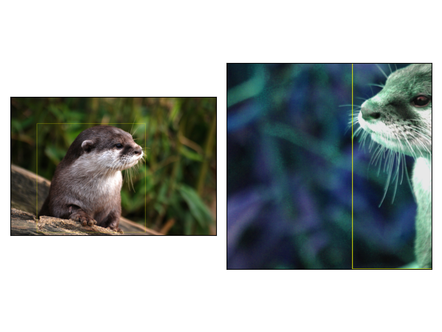

先日，PyTorchの画像操作系の処理がまとまったライブラリ，TorchVisionのバージョン0.16.0が公開されました．
このアップデートで，データ拡張でよく用いられる`torchvision.transforms`のバージョンv2のドキュメントが加筆されました．
`torchvision.transforms.v2`自体はベータ版として0.15.0から存在していたものの，今回のアップデートでドキュメントが充実し，recommendになったことから，
実際に以前の方法とどのように異なるのか見ていきたいと思います．
なお，v2はまだベータ版です．0.17.0で安定版となるようです．

- リリースノート

<https://github.com/pytorch/vision/releases/tag/v0.16.0>

- ドキュメント

<https://pytorch.org/vision/stable/transforms.html#v2-api-reference-recommended>

今後のアップデートはv2のみに行われるようなので，この機会に移行しておきたいところです．

## 主な変更点

- transformsの入力として物体検出のBBoxや，セグメンテーションマスク，動画を扱えるようになった点
- CutMixやMixUpといったデータ拡張手法に対応した点
- 高速化
- 任意の入力(dict, lists, tuplesなど)を受け付ける
- Resizeなどがtorch.uint8型を入力として受け取れる

上記の変更点をもとに，v2では以下の方法が推奨されています．

- PIL.Image型の代わりに，Tensor型を入力とする
- Resizeなどを行う場合は，入力をtorch.uint8([0~255])にする
- Resizeはバイリニアかバイキュービックで行う

## 移行方法

移行方法は簡単です．今まで`import torchvision.transforms`としていたところを，`import torchvision.transforms.v2`とするだけです．

```python
# V1
from torchvision import transforms

# V2(transformsのままv2を呼び出す場合)
from torchvision.transforms import v2 as transforms
```

## 実験1: 変換速度の計測

前述した通り，V2ではtransformsの高速化やuint8型への対応が変更点として挙げられています．
そこで，v1, v2で速度の計測を行ってみたいと思います．

v1, v2について，PIL.ImageとTensor型で入力した場合でそれぞれ比較してみます．

入力画像として以下を用意しました．
Resizeの効果を見たいので，大きめのサイズの画像を用意しました．



> 引用: <https://publicdomainq.net/otter-animal-0014492/>

```bash
identify image.jpg
image.jpg JPEG 3872x2592 3872x2592+0+0 8-bit sRGB 1.93051MiB 0.000u 0:00.001
```

測定したコードは以下です．

```python
import time

import torch
import torchvision
import torchvision.transforms as v1
import torchvision.transforms.v2 as v2
from PIL import Image


def get_v1_transforms_tensor():
    return v1.Compose(
        [
            v1.RandomHorizontalFlip(p=0.5),
            v1.RandomVerticalFlip(p=0.5),
            v1.RandomResizedCrop((224, 224), (0.01, 2.0), antialias=False),
            v1.Normalize((0.5, 0.5, 0.5), (0.5, 0.5, 0.5)),
        ]
    )


def get_v2_transforms_tensor():
    return v2.Compose(
        [
            v2.RandomHorizontalFlip(p=0.5),
            v2.RandomVerticalFlip(p=0.5),
            v2.RandomResizedCrop((224, 224), (0.01, 2.0), antialias=False),
            v2.ToDtype(torch.float32, scale=True),
            v2.Normalize((0.5, 0.5, 0.5), (0.5, 0.5, 0.5)),
        ]
    )


def get_v1_transforms_pil():
    return v1.Compose(
        [
            v1.ToTensor(),
            v1.RandomHorizontalFlip(p=0.5),
            v1.RandomVerticalFlip(p=0.5),
            v1.RandomResizedCrop((224, 224), (0.01, 2.0), antialias=False),
            v1.Normalize((0.5, 0.5, 0.5), (0.5, 0.5, 0.5)),
        ]
    )


def get_v2_transforms_pil():
    return v2.Compose(
        [
            v2.ToImage(),
            v2.RandomHorizontalFlip(p=0.5),
            v2.RandomVerticalFlip(p=0.5),
            v2.RandomResizedCrop((224, 224), (0.01, 2.0), antialias=False),
            v2.ToDtype(torch.float32, scale=True),
            v2.Normalize((0.5, 0.5, 0.5), (0.5, 0.5, 0.5)),
        ]
    )


def main():
    num_iter = 200

    transforms = get_v1_transforms_tensor()
    elapsed_times = []
    for _ in range(num_iter):
        img = torchvision.io.read_image("./image.jpg")

        t = time.time()
        img = img / 255
        transforms(img)
        elapsed_times.append(time.time() - t)
    elapsed_times = elapsed_times[len(elapsed_times) // 2 :]
    print("V1 Elapsed Time(Input Tensor): ", sum(elapsed_times) / len(elapsed_times) * 1000, "ms")

    transforms = get_v2_transforms_tensor()
    elapsed_times = []
    for _ in range(num_iter):
        img = torchvision.io.read_image("./image.jpg")

        t = time.time()
        transforms(img)
        elapsed_times.append(time.time() - t)
    elapsed_times = elapsed_times[len(elapsed_times) // 2 :]
    print("V2 Elapsed Time(Input Tensor): ", sum(elapsed_times) / len(elapsed_times) * 1000, "ms")

    transforms = get_v1_transforms_pil()
    elapsed_times = []
    for _ in range(num_iter):
        img = Image.open("./image.jpg").convert("RGB")
        t = time.time()
        transforms(img)
        elapsed_times.append(time.time() - t)
    elapsed_times = elapsed_times[len(elapsed_times) // 2 :]
    print("V1 Elapsed Time(Input PIL): ", sum(elapsed_times) / len(elapsed_times) * 1000, "ms")

    transforms = get_v2_transforms_pil()
    elapsed_times = []
    for _ in range(num_iter):
        img = Image.open("./image.jpg").convert("RGB")
        t = time.time()
        transforms(img)
        elapsed_times.append(time.time() - t)
    elapsed_times = elapsed_times[len(elapsed_times) // 2 :]
    print("V2 Elapsed Time(Input PIL): ", sum(elapsed_times) / len(elapsed_times) * 1000, "ms")


if __name__ == "__main__":
    main()
```

実行結果は以下となりました．

```bash
python exp.py
V1 Elapsed Time(Input Tensor):  42.47044086456299 ms
V2 Elapsed Time(Input Tensor):  4.662487506866455 ms
V1 Elapsed Time(Input PIL):  63.41712474822998 ms
V2 Elapsed Time(Input PIL):  13.053297996520996 ms
```

まとめると以下です．

| version | Input  | elapsed time |
|---------|--------|-------------:|
| v1      | Tensor |      42.4704 |
| v2      | Tensor |       4.6625 |
| v1      | PIL    |      63.4171 |
| v2      | PIL    |      13.0533 |

今回の場合は，Tensorを入力した場合は9.1倍，PILを入力した場合は4.9倍の高速化となりました．
だいぶ早いですね〜．

## 実験2: Boxを入力してみる

今までのtransformsは，画像しか入力できませんでしたが，今回からBBoxやmaskを入力できるようになったみたいです．
というわけで，今回は簡単に用意できるBBoxを使って実験してみようと思います．

以下のコードは公式のTutorialから拝借しました．

https://pytorch.org/vision/stable/auto_examples/transforms/plot_transforms_getting_started.html

```python
import matplotlib.pyplot as plt
import torch
from torchvision import tv_tensors
from torchvision.io import read_image
from torchvision.transforms import v2
from torchvision.transforms.v2 import functional as F
from torchvision.utils import draw_bounding_boxes, draw_segmentation_masks


def plot(imgs, row_title=None, **imshow_kwargs):
    if not isinstance(imgs[0], list):
        # Make a 2d grid even if there's just 1 row
        imgs = [imgs]

    num_rows = len(imgs)
    num_cols = len(imgs[0])
    _, axs = plt.subplots(nrows=num_rows, ncols=num_cols, squeeze=False)
    for row_idx, row in enumerate(imgs):
        for col_idx, img in enumerate(row):
            boxes = None
            masks = None
            if isinstance(img, tuple):
                img, target = img
                if isinstance(target, dict):
                    boxes = target.get("boxes")
                    masks = target.get("masks")
                elif isinstance(target, tv_tensors.BoundingBoxes):
                    boxes = target
                else:
                    raise ValueError(f"Unexpected target type: {type(target)}")
            img = F.to_image(img)
            if img.dtype.is_floating_point and img.min() < 0:
                # Poor man's re-normalization for the colors to be OK-ish. This
                # is useful for images coming out of Normalize()
                img -= img.min()
                img /= img.max()

            img = F.to_dtype(img, torch.uint8, scale=True)
            if boxes is not None:
                img = draw_bounding_boxes(img, boxes, colors="yellow", width=3)
            if masks is not None:
                img = draw_segmentation_masks(
                    img, masks.to(torch.bool), colors=["green"] * masks.shape[0], alpha=0.65
                )

            ax = axs[row_idx, col_idx]
            ax.imshow(img.permute(1, 2, 0).numpy(), **imshow_kwargs)
            ax.set(xticklabels=[], yticklabels=[], xticks=[], yticks=[])

    if row_title is not None:
        for row_idx in range(num_rows):
            axs[row_idx, 0].set(ylabel=row_title[row_idx])

    plt.tight_layout()


def main():
    img = read_image("./image.jpg")

    boxes = tv_tensors.BoundingBoxes(
        [[500, 500, 2540, 2540]],
        format="XYXY",
        canvas_size=img.shape[-2:],
    )

    transforms = v2.Compose(
        [
            v2.RandomResizedCrop(size=(1024, 1024), antialias=True),
            v2.RandomPhotometricDistort(p=1),
            v2.RandomHorizontalFlip(p=1),
        ]
    )
    out_img, out_boxes = transforms(img, boxes)
    print(type(boxes), type(out_boxes))

    plot([(img, boxes), (out_img, out_boxes)])
    plt.show()


if __name__ == "__main__":
    main()
```

結果は以下のようになります．


上記のコード例で重要な部分はここです．

```python
boxes = tv_tensors.BoundingBoxes(
            [[500, 500, 2540, 2540]],
            format="XYXY",
            canvas_size=img.shape[-2:],
        )
```

v2ではBBoxは`tv_tensors.BoundingBoxes`に，
Maskは`tv_tensors.Mask`に入れて入力することで，Box・Maskへもデータ拡張ができるようです．

## まとめ

以上簡単にですが，torchvision.transformsのv2の紹介でした．
実験1で示したように，Resizeをuint8で処理できるようになったこともあってか，
transformsの大幅な高速化がなされています．
導入も簡単なので，torchvisio.transformsを使用している人はv2への移行を検討してみても良いのかもしれません．
