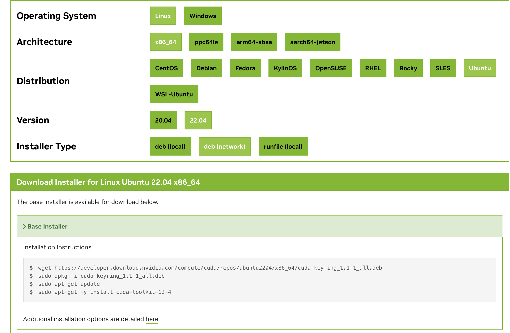
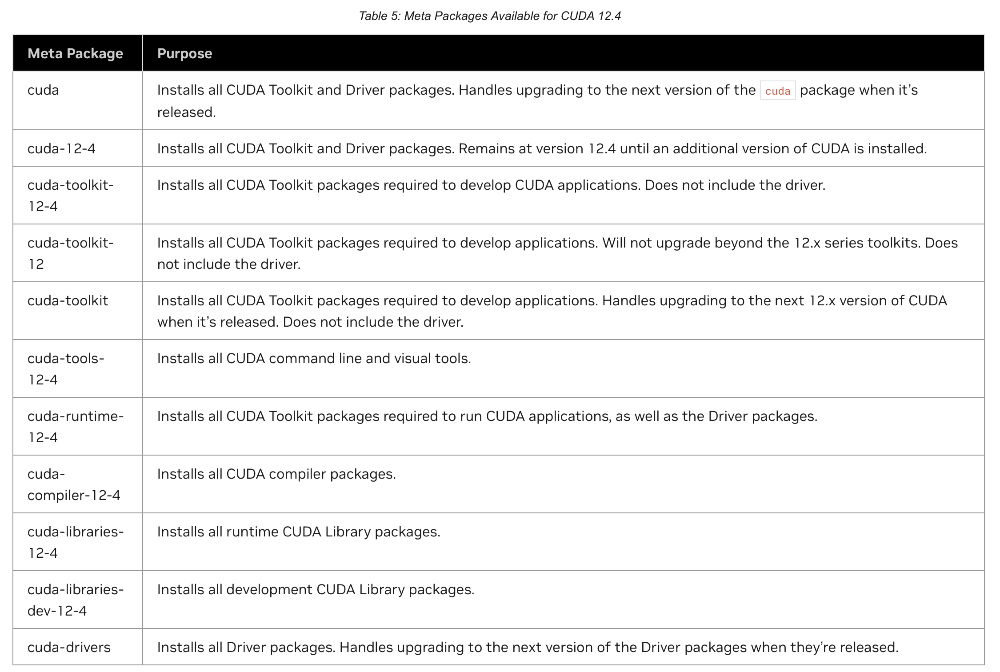

こんにちは．今回はNVIDIA CUDAをインストールして，
PyTorchやTensorflowなどをNVIDIA GPUを利用して実行するための環境を構築する手順を書きます．

巷ではこういう記事がたくさん出ているかと思いますが，
本記事では，研究室や会社などで共有利用するサーバとして想定している点が他の記事との相違点です．

私は今まではNVIDIA社の佐々木氏が書いていた，以下の「NVIDIA Docker って今どうなってるの？ (20.09 版)」にお世話になっていたのですが，近年状況も変わってきているので，ここで一旦まとめます．

https://medium.com/nvidiajapan/nvidia-docker-って今どうなってるの-20-09-版-558fae883f44

本記事では以下のような環境を構築することを目的とします．

- Ubuntu 22.04 LTS Server(Desktopでも可)
- Docker
- NVIDIA Driver, CUDA, NVIDIA Docker

## Ubuntuのインストール・設定

まずはサーバーにUbutntu 22.04 LTS Serverをインストールします．
この記事を書いている時点ではあと1ヶ月で24.04 LTSが出るところですが，各種ライブラリが対応するまでは22.04で良いでしょう．

Ubuntuのインストールは各自好きな方法で行ってください．
私は以下のような設定でいつも入れています．
- server minimizeを選択
- サードパーティライブラリはインストールしない
- partition: use as bootを選択してboot領域を1GB割り当てて，残りを`/`(ルート)にマウント
- OpenSSH-ServerをInstall

ネットワークの設定はNICを複数束ねてbondingする場合であっても，インストール後に後からnetplanをいじった方が楽です．

Ubuntuをインストールし終わったら，コンソールにログインしてリモートで作業ができるように設定を行なっていきます．

### パッケージインストール

まずはお好きなライブラリのインストールから

```bash
sudo apt update
sudo apt upgrade

sudo apt install -y \
    avahi-daemon git vim emacs build-essential \
    wget curl jq ffmpeg htop tmux screen parallel \
    imagemagick geeqie iputils-ping net-tools zsh

# Pythonのビルドができるようにパッケージをインストール
sudo apt install -y \
    build-essential libssl-dev zlib1g-dev \
    libbz2-dev libreadline-dev libsqlite3-dev curl \
    libncursesw5-dev xz-utils tk-dev libxml2-dev libxmlsec1-dev \
    libffi-dev liblzma-dev
```

インストールしたパッケージについて簡単に説明します．

- `git, wget, curl` 必須
- `avahi-daemon` mDNSのためのライブラリで，入れておくとDNSを立てなくてもローカルLANから`ssh server.local`などでWindows, macOS, Linuxのどこからでもアクセスできます．
- `emacs, vim` 両方入れておけば戦争を回避できます．
- `build-essential` ビルドするためのライブラリが色々入ります
- `jq` json parser．機械学習データセットの情報はjsonで提供されていることもあるので入れます
- `ffmpeg` コマンドラインから動画を処理できます
- `imagemagick` コマンドラインから画像を扱えます
- `tmux, screen` ログアウト後もシェルを維持できるので，時間の長い学習スクリプトを回す時に利用します．`nohup`でもいいです．
- `parallel` サーバーマシンは大体コア数が多いので，並列処理して効率化しましょう．`xargs`でもいいです
- `htop` システムの使用状況を見れます．`top`でもいいですが，htopの方が見やすいのでこちらを入れてます．
- `geeqie` 画像ビュワーです．軽いのでXwindow越しでも使えます．
- `iputils-ping, net-tools` `ping`で他のサーバの状況やインターネットの疎通確認に使えます．
- `zsh` 好きなshellを入れてください．

2つ目の`apt install`はPythonをビルドするためのパッケージです．サーバの利用者の中には`pyenv`あたりを利用する人もいると思うので，入れておきましょう．

### ネットワーク設定

次にネットワークを設定します．
Ubuntu Serverはnetplanでネットワークの設定を行うので，`/etc/netplan`以下のyamlファイルの設定を行います．
Ubuntu Desktopの場合はNetworkManagerから行ってください．
IPアドレスを固定する場合は，以下のように設定します．

Ubuntu22.04から`gateway4`の書き方が`routes`に変わっているので注意です．

```yaml
# This is the network config written by 'subiquity'
network:
  ethernets:
    enp42s0:
      dhcp4: false
      addresses:
        - 192.168.0.2/24
      nameservers:
        addresses: [192.168.0.1]
      # 以下はダメ
      # gateway4: 192.168.0.1
      # routesで書く
      routes:
        - to: default
          via: 192.168.0.1
  version: 2
```

設定が終わったら`sudo netplan apply`で設定を有効化します．

### SSHの設定

次にSSH-Serverの設定を行います．
ここは環境によって変わるかと思いますので，各自設定してください．
ローカルLANに置く場合は，`PermitRootLogin`や`PasswordAuthentication no`あたりをしておけばいいです．

ここまで終わればリモートから作業できますので，サーバーをラックに入れるなりしておいてください．
NFSやLDAPを設定する場合はここでやるか，ラックに入れてから行いましょう．

## Dockerのインストール

次にDockerのインストールを行います．
最近はLinuxでもDocker Desktopが出ていますが，Linuxは基本Engineで大丈夫でしょう．

以下の公式サイトの下の方に「Install using the convenience script」という項目があり，インストールスクリプトをダウンロードして簡単に導入できます．

<https://docs.docker.com/engine/install/ubuntu/>

```bash
curl -fsSL https://get.docker.com -o get-docker.sh
sudo sh get-docker.sh
```

共用サーバの場合，rootless Dockerを使うのもありです．その場合はNVIDIA Dockerを導入するためのコマンドが若干異なるので注意してください．

また，ユーザーがsudoなしでdockerを扱えるようにユーザーをdockerグループに入れておきます．

```bash
sudo gpasswd -a [ユーザー名] docker
```

## NVIDIA Driver, CUDA, Dockerのインストール

次に機械学習の肝となるNVIDIA GPUを扱うためのドライバーやCUDAを入れていきます．

### aptリポジトリの登録

以下のサイトから環境を選択して，cuda-keyringをインストールします．

<https://developer.nvidia.com/cuda-downloads>



今回のUbuntu 22.04の場合は

- Linux
- x86_64 (armの場合はarm64-sbsa)
- Ubuntu
- 22.04
- dev(network)

を選択します．
そして表示されたスクリプトのうち，`sudo apt-get update`まで行います．

```bash
wget https://developer.download.nvidia.com/compute/cuda/repos/ubuntu2204/x86_64/cuda-keyring_1.1-1_all.deb
sudo dpkg -u cuda-keyring_1.1-1_all.deb
sudo apt-get update
```

### NVIDIA Driver, CUDAのインストール

次にCUDAのインストールを行いますが，その前に以下の表を確認しましょう．

https://docs.nvidia.com/cuda/cuda-installation-guide-linux/#meta-packages



上記の表を見ると，`sudo apt install cuda`を行えばdriverもcudaも入って良さそうですが，driverとcudaのいずれかのみをupgradeしたい場合に，依存関係で両方upgradeしなければならなくなります．  
よって，ここでは`cuda-toolkit`, `cuda-driver`をインストールすることで，依存関係をわけてインストールします．

```bash
sudo apt install -y cuda-toolkit
sudo apt install -y cuda-driver
```

CUDAのバージョンですが，ユーザーには基本的にDockerを用いてもらうことで，ホストマシンはとりあえず最新を入れておけば良くなるので，Dockerを布教しておきましょう．

### cuDNNのインストール

cuDNNはNVIDIA CUDA Deep Neural Network libraryの略で，有効にするとDNNの処理の一部でGPU向けに高速化された実装を利用できます．

例によって以下のドキュメントから，`cudnn`を入れればいいことがわかります．
(昔はlibcudnn8とかだった気がする)

https://docs.nvidia.com/deeplearning/cudnn/installation/linux.html#additional-package-manager-capabilities

```bash
sudo apt install cudnn
```

### NVIDIA Docker

NVIDIA Dockerは現在はNVIDIA Container Toolkitと呼ばれる体系の中にあります．なので，DockerコンテナからNVIDIA GPUを扱うにはnvidia-container-toolkitを入れます．

```bash
sudo apt-get install -y nvidia-container-toolkit
```

次にDockerの設定を行います．rootless Dockerの場合はコマンドが異なりますので注意してください．([Docker公式ドキュメント](https://docs.nvidia.com/datacenter/cloud-native/container-toolkit/latest/install-guide.html#rootless-mode)を参照)

```bash
sudo nvidia-ctk runtime configure --runtime=docker
```

次にDockerのconfigをいじります．以下のQiitaの記事やGithubのIssueで言われているように，「起動中のDockerコンテナでGPUが使えてたのにしばらくすると使えなくなる」現象があります．これはdockerのcgroupの管理がsystemdになっているために`systemctl deamon-reload`した時にGPUの認識がおかしくなるようです．

https://qiita.com/tttamaki/items/4f369633b7f53f5131a1

Dockerをデフォルトで入れた時，`docker info`は以下のようになっています．

```bash
docker info

# 中略
 Cgroup Driver: systemd
 Cgroup Version: 2
```

編集するファイルは`/etc/docker/daemon.json`です．

```bash
{
    "runtimes": {
        "nvidia": {
            "args": [],
            "path": "nvidia-container-runtime"
        }
    },
    "exec-opts": ["native.cgroupdriver=cgroupfs"]
}
```

ここで追加するのは`"exec-opts": ["native.cgroupdriver=cgroupfs"]`の行です．
書き込みが終わったらdockerを再起動して，変更ができているか確認します．

```bash
sudo systemctl restart docker
docker info

# 中略
 Cgroup Driver: cgroupfs
 Cgroup Version: 2
```

`cgroupfs`になっていればOKです．

## 再起動&確認

ここでNVIDIA Driverを有効にするために，サーバーの再起動を行います．

```bash
sudo reboot now
```

再起動をしたら，.bashrcにPATHを通します．

```bash
export PATH="/usr/local/cuda/bin:$PATH"
export LD_LIBRARY_PATH="/usr/local/cuda/lib64:$LD_LIBRARY_PATH"
export CUDA_HOME="/usr/local/cuda"
```

```bash
source ~/.bashrc
```

そしてホストマシンと，コンテナ内の両方でGPUを認識できるかを確認します．

- ホストマシン

```bash
nvidia-smi

+---------------------------------------------------------------------------------------+
| NVIDIA-SMI 545.23.08              Driver Version: 545.23.08    CUDA Version: 12.3     |
|-----------------------------------------+----------------------+----------------------+
| GPU  Name                 Persistence-M | Bus-Id        Disp.A | Volatile Uncorr. ECC |
| Fan  Temp   Perf          Pwr:Usage/Cap |         Memory-Usage | GPU-Util  Compute M. |
|                                         |                      |               MIG M. |
|=========================================+======================+======================|
|   0  NVIDIA GeForce RTX 4090        On  | 00000000:03:00.0 Off |                  Off |
|  0%   46C    P8              34W / 450W |    112MiB / 24564MiB |      0%      Default |
|                                         |                      |                  N/A |
+-----------------------------------------+----------------------+----------------------+
|   1  NVIDIA GeForce RTX 4090        On  | 00000000:81:00.0 Off |                  Off |
|  0%   50C    P8              28W / 450W |     15MiB / 24564MiB |      0%      Default |
|                                         |                      |                  N/A |
+-----------------------------------------+----------------------+----------------------+

+---------------------------------------------------------------------------------------+
| Processes:                                                                            |
|  GPU   GI   CI        PID   Type   Process name                            GPU Memory |
|        ID   ID                                                             Usage      |
|=======================================================================================|
+---------------------------------------------------------------------------------------+

nvidia-smi -L

GPU 0: NVIDIA GeForce RTX 4090 (UUID: GPU-0b...)
GPU 1: NVIDIA GeForce RTX 4090 (UUID: GPU-0e...)
```

- コンテナ

```bash
docker run --rm --gpus all nvidia/cuda:12.3.2-base-ubuntu22.04 nvidia-smi
Unable to find image 'nvidia/cuda:12.3.2-base-ubuntu22.04' locally
12.3.2-base-ubuntu22.04: Pulling from nvidia/cuda
01007420e9b0: Pull complete
bfc08b17629d: Pull complete
86fc789646b5: Pull complete
6b62141c2a21: Pull complete
e0e30e504698: Pull complete
Digest: sha256:8cecfe099315f73127d6d5cc43fce32c7ffff4ea0460eefac48f2b7d811ce857
Status: Downloaded newer image for nvidia/cuda:12.3.2-base-ubuntu22.04
+---------------------------------------------------------------------------------------+
| NVIDIA-SMI 545.23.08              Driver Version: 545.23.08    CUDA Version: 12.3     |
|-----------------------------------------+----------------------+----------------------+
| GPU  Name                 Persistence-M | Bus-Id        Disp.A | Volatile Uncorr. ECC |
| Fan  Temp   Perf          Pwr:Usage/Cap |         Memory-Usage | GPU-Util  Compute M. |
|                                         |                      |               MIG M. |
|=========================================+======================+======================|
|   0  NVIDIA GeForce RTX 4090        On  | 00000000:03:00.0 Off |                  Off |
|  0%   46C    P8              33W / 450W |    112MiB / 24564MiB |      0%      Default |
|                                         |                      |                  N/A |
+-----------------------------------------+----------------------+----------------------+
|   1  NVIDIA GeForce RTX 4090        On  | 00000000:81:00.0 Off |                  Off |
|  0%   50C    P8              28W / 450W |     15MiB / 24564MiB |      0%      Default |
|                                         |                      |                  N/A |
+-----------------------------------------+----------------------+----------------------+

+---------------------------------------------------------------------------------------+
| Processes:                                                                            |
|  GPU   GI   CI        PID   Type   Process name                            GPU Memory |
|        ID   ID                                                             Usage      |
|=======================================================================================|
+---------------------------------------------------------------------------------------+
```

上記のように認識されていればOKです．

次にCUDAのバージョンを確認します．以下のように表示されていればOKです．

```bash
nvcc -V

nvcc: NVIDIA (R) Cuda compiler driver
Copyright (c) 2005-2023 NVIDIA Corporation
Built on Wed_Nov_22_10:17:15_PST_2023
Cuda compilation tools, release 12.3, V12.3.107
Build cuda_12.3.r12.3/compiler.33567101_0
```

## NVIDIA DriverとCUDAの自動アップグレードの停止

Ubuntuのパッケージマネージャのaptはパッケージの自動更新の仕組みがあるのですが，
NVIDIA Driverが自動更新されると，Loadされているドライバと実際のバージョンのミスマッチを起こして`nvidia-smi`実行時に`Failed to initialize NVML: Driver/library version mismatch`エラーを引き起こして，ステータスが見られず，新しいジョブが投げられなくなったりします．
なので，長期運用するためにはNVIDIA系のライブラリは自動更新を止めることをお勧めします．

自動更新を止めるには，`/etc/apt/apt.conf.d/50unattended-upgrades`を編集します．
上の方にある`Unattended-Upgrade::Package-Blacklist`に`.*nvidia, .*libnvidia, .*cuda`を追加します．

```bash
// Python regular expressions, matching packages to exclude from upgrading
Unattended-Upgrade::Package-Blacklist {
    // The following matches all packages starting with linux-
//  "linux-";

    // Use $ to explicitely define the end of a package name. Without
    // the $, "libc6" would match all of them.
//  "libc6$";
//  "libc6-dev$";
//  "libc6-i686$";

    // Special characters need escaping
//  "libstdc\+\+6$";

    // The following matches packages like xen-system-amd64, xen-utils-4.1,
    // xenstore-utils and libxenstore3.0
//  "(lib)?xen(store)?";

    // For more information about Python regular expressions, see
    // https://docs.python.org/3/howto/regex.html
    ".*nvidia";
    ".*libnvidia";
    ".*cuda";
};
```

これで自動更新が停止されます．アップグレードする際は手動で`sudo apt upgrade cuda-driver cuda-toolkit`を実行してください．

ちなみに，データセンタ用のGPU(Tesla, RTX A6000, RTX 6000Ada, A100, H100など)はDriverのバージョンが古くても，新しいバージョンのCUDAを実行できる
Forward capabilityという機能があります．そのためDGX-A100とかは自動更新されないようになっているので，基本的に自動更新は止めて良いと思います．

以上で機械学習サーバの構築の最低条件は完了です．
あとはユーザーを追加するなりLDAP, NFSを設定するなりしてください．
お疲れ様でした！
