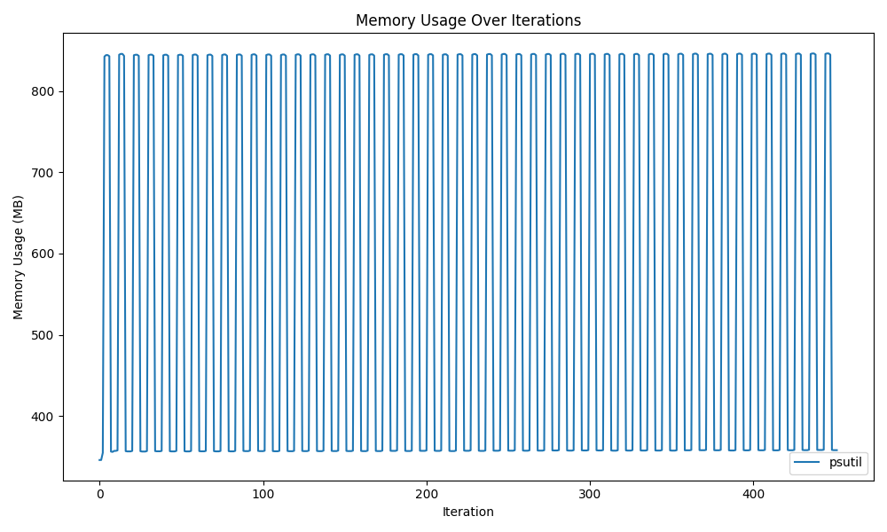
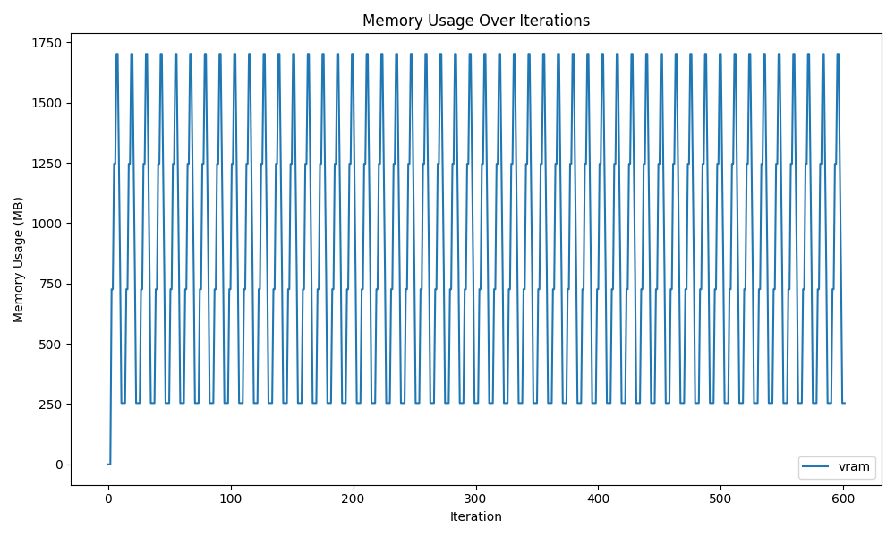
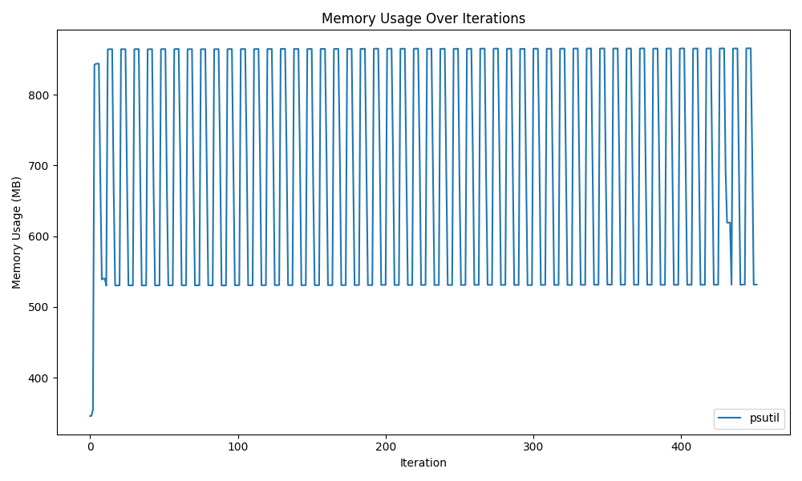
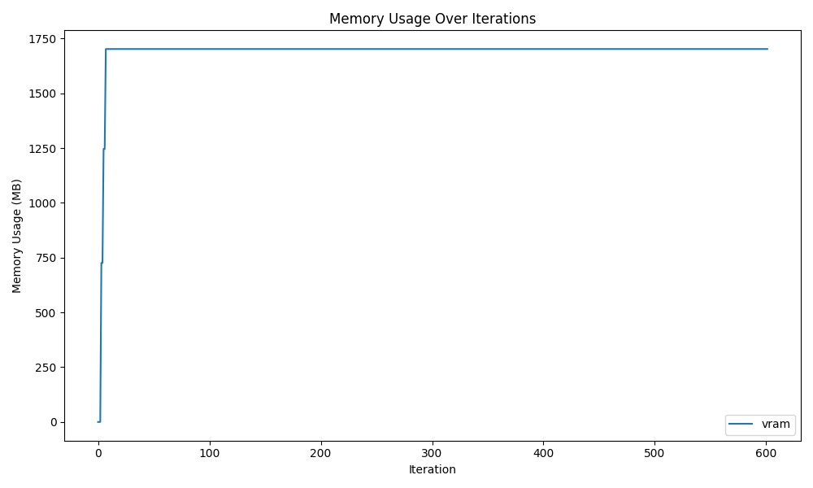

こんにちは。今回は、一度ロードしたHuggingFaceのモデルをアンロードして、CPU RAMとGPU VRAMぞれぞれについてメモリ解放する方法について書いていきます。
HuggingFaceと書きましたが、本記事で紹介する方法は、PyTorchモデルにおいても利用できます。

いくつか試行錯誤したので、まずはメモリ解放する方法について結論から述べ、そのあとでどのような方法を試したかや、メモリ解放の仕組みについて解説していきます。

検証コードは以下のリポジトリにDocker付きで用意してあります。

https://github.com/mjun0812/hf-model-cleanup-experiment

また、今回の対象はNVIDIA GPUを対象としています。ROCm(AMD GPU)は検証環境がありません...。

## 背景

結論から話すと言っておいてなんですが、まずメモリ解放が必要になるシーンを考えてみたいと思います。
メモリを解放する必要があるシーンで代表的なのは **「動的に複数のモデルを提供するAPI」** なのではないかと思います。世の中にはPythonの代表的なフレームワークであるFastAPIでPyTorchのモデルを提供する例が溢れていますが、1つのモデルのみを対象としていたり、事前に決まったモデルをロードする例が多いように見受けられます。実際にMLOps的に学習したモデルをAPIとして、素早く提供・検証していくためには、新しいモデルを動的に呼び出す仕掛けが必要です。そのためには次々呼び出されるモデルに対して古いモデルをメモリからアンロードしなければ、RAMやVRAMが溢れてしまい、APIが機能停止になってしまいます。
今回紹介する方法は、そのようなシーンに応用可能で、実際に私も活用しています。

## メモリ解放方法 CPU編

CPUで推論する場合、RAMからモデルを開放する方法は以下のように行います。
注意点として、PythonがCPythonである場合にのみ有効です。(ほとんどの場合CPythonかと思います。)

```python
import ctypes
import gc
import platform

from transformers import AutoModel


def ctype_memory_release():
    if platform.system() == "Darwin":  # macOS
        libc = ctypes.CDLL("libc.dylib")
        libc.malloc_zone_pressure_relief(0, 0)
    elif platform.system() == "Linux":
        ctypes.CDLL("libc.so.6").malloc_trim(0)

model = AutoModel.from_pretrained("bert-base-uncased")
del model
gc.collect()
ctype_memory_release()
```

または、下記のように、環境変数`MALLOC_TRIM_THRESHOLD_=-1`を設定すれば、ctypesを使わずにメモリ解放が可能です。

```python
"""
このファイルを`MALLOC_TRIM_THRESHOLD_=-1 python main.py`で実行
"""
import gc

from transformers import AutoModel


model = AutoModel.from_pretrained("bert-base-uncased")
del model
gc.collect()
```

実際に、複数のモデルをロード・アンロードしたときのメモリ使用量の推移グラフは以下です。
psutilで実行しているプロセスの消費メモリ量を計測しました。
ソースコードは[ここ](https://github.com/mjun0812/hf-model-cleanup-experiment/blob/main/cpu/4.py)あたりです。



グラフの値が上下し、横方向に水平に推移しているため、正しくメモリ解放ができていることがわかります。

## メモリ解放方法 GPU編

続いて、GPUにメモリをロードした場合のメモリ解放方法を紹介します。

```python
import gc

import torch
from transformers import AutoModel


model = AutoModel.from_pretrained("bert-base-uncased")
del model
gc.collect()
torch.cuda.empty_cache()
```

CPU編と同様に、`del model; gc.collect()`をした後に、追加で`torch.cuda.empty_cache()`を呼び出すことで、メモリ解放を行うことができます。

以下にVRAMの推移のグラフを示します。計測は`nvidia-smi`コマンドでプロセスが占有しているメモリ量を確認することで行いました。
ソースコードは[この辺り](https://github.com/mjun0812/hf-model-cleanup-experiment/blob/main/gpu/2.py)です。



グラフが上下かつ、水平に続いているため、メモリ使用量が単調増加しておらず、正しくメモリ解放ができていることが読み取れます。
しかし、CPUのグラフと比較すると、メモリ解放時に最下部の0MB付近までメモリが解放されていないです。後述しますが、PyTorchとCUDAの仕様上、これが解放の限界値です。最初にGPUを使い始めてから254MB分は解放できず、メモリ上に残ることとなります。

以上が、本記事の結論となるメモリ解放の具体的な方法でした。ここからは、メモリ解放を行うにあたって、試行したことと、その解説を行います。

## メモリ解放方法 解説 CPU編

まず、CPUのメモリ解放を行うにあたり、Pythonのガベージコレクションについて触れます。
詳しくは他の記事等に譲りますので、最低限の解説をします。

### ガベージコレクション

ガベージコレクションとは、実行中のプログラムが占有しているメモリのうち、不要になったものを自動的に解放する仕組みのことで、メモリ管理の方法として他の言語でも一般的なものです。
Pythonの場合は、オブジェクトに対する参照の個数である「参照カウント」を基準に自動的にメモリ解放が行われます。

以下に実際の例を示します。コード中のコメントにあるように、オブジェクトに対して参照する変数がなくなった場合に、任意のタイミングでdict分のメモリがガベージコレクションによって解放されます。
これまでのメモリ解放のコードで使われている`del`は変数を削除し、オブジェクトの参照カウントを1減らす操作となります。
(実際には参照数が0になっても解放されない場合があるが、それは他の記事を参照してください。)

```python
# dictに対して変数aが参照しているので、参照カウント=1
a = {"name": "mjun", "name": "Taro"}
# bも参照しているので、参照カウント=2
b = a
# bがaのdictを参照するのをやめたので、参照カウント=1
b = {}
# aも参照をやめたので、参照カウント=0
#   -> ガベージコレクションでメモリ解放される
a = None
```

ガベージコレクションは動作が遅いため都度メモリ解放を行うのではなく、任意のタイミングでメモリ解放を行います。
即座にメモリ解放を手動で行う場合は標準で用意されている`gc`モジュールを利用します。
以下のように、`gc.collect()`を行うと、ガベージコレクションが動作して、即時メモリ解放が行われます。

https://docs.python.org/ja/3.13/library/gc.html

```python
import gc

gc.collect()
```

一見、ここまでの内容でモデルのメモリ解放が行えるように見えますが、**この方法だけではメモリ解放を行うことはできません。**
実際に、以下の図のように一部のメモリしか解放できません。



### glibcのdynamic mmap threshold

さて、ここからが本題です。前述の`gc.collect()`ではモデルのメモリ解放ができないことがわかりました。そこで、Pythonの処理系であるCPython、さらにそれがリンクしている`glibc`へと潜っていきます。

ちなみに、`ldd $(which python)`をすると、Pythonにリンクされている`libc.so.6`が確認できます。

```bash
ldd $(which python)
 linux-vdso.so.1 (0x00007ffe327fc000)
 /home/mjun/.venv/bin/../lib/libpython3.11.so.1.0 => not found
 libpthread.so.0 => /lib/x86_64-linux-gnu/libpthread.so.0 (0x000075b9061eb000)
 libdl.so.2 => /lib/x86_64-linux-gnu/libdl.so.2 (0x000075b9061e6000)
 libutil.so.1 => /lib/x86_64-linux-gnu/libutil.so.1 (0x000075b9061e1000)
 libm.so.6 => /lib/x86_64-linux-gnu/libm.so.6 (0x000075b9060f8000)
 librt.so.1 => /lib/x86_64-linux-gnu/librt.so.1 (0x000075b9060f1000)
 libc.so.6 => /lib/x86_64-linux-gnu/libc.so.6 (0x000075b905e00000)
 /lib64/ld-linux-x86-64.so.2 (0x000075b90620c000)
```

glibcでは、以前はメモリ解放関数である`free`を呼び出した場合には、即座にOSにメモリを返却する仕様となっていました。しかし、`free`の呼び出し回数が多い場合はパフォーマンスが低下するため、返却するメモリの割合を制限する変更(dynamic mmap threshold)が加えられました。
(参考: <https://jp.tenable.com/plugins/nessus/88777>)
これにより、先ほどの`gc.collect()`だけでは、モデルが占有しているメモリの全てが解放されません。
モデルのメモリ解放を行うには、全ての占有メモリの返却を即座に行わせる必要があります。

[glibcのmallopt(3)のマニュアル](https://man7.org/linux/man-pages/man3/mallopt.3.html)を見ると、この設定を変更する環境変数が用意されています。
それが`MALLOC_TRIM_THRESHOLD_=-1`です。このように設定することにより、OSにメモリが即座に返されるようになり、モデルの全てのメモリ解放が行えるようになります。

環境変数を設定するとPython全体の動作に影響してしまうため、glibcを使って強制的にメモリ解放する方法もあります。それが`malloc_trim`です。`malloc_trim(0)`を実行すると、プログラムが使用していないヒープメモリを可能な限り解放します。Pythonからglibcの関数を呼び出すには以下のようにします。

```python
import ctypes

ctypes.CDLL("libc.so.6").malloc_trim(0)
```

PythonからCを呼び出すという、なんとも特殊な方法ですが、この方法でも完全なメモリ解放が行えます。

他には以下の方法を試行しましたが、効果はありませんでした。

- モデルの重みや勾配(torch.Tensor)を手動で全て削除
- `os.environ["MALLOC_TRIM_THRESHOLD_"] = "-1"`

以上がCPUの解説です。次はGPUです。

## メモリ解放方法 解説 GPU編

GPUメモリは、HuggingFace内部で使われている、PyTorchの`torch.cuda`モジュールを併用することで、メモリ解放を行います。

まずは、torchを使わずに、`del model; gc.collect()`を使って、メモリ解放を試みた結果が以下です。



ご覧の通り、VRAMが解放されていません。というのも、PyTorchで1度確保されたVRAM領域は、実際に使用されていなくても、Reserved Memory(予約済みメモリ)として保持されてしまうためです。
通常は、モデルやTensorのGPUへの転送でVRAMの読み書きを頻繁に行うため、プロセスがある程度メモリを予約することで高速化を図るのですが、複数のユーザーやプロセスがGPUを使用する場合は、予約されたメモリ分、他のプロセスがVRAMを確保できなくなってしまいます。

そこで、PyTorchの`torch.cuda`モジュールに定義されている、`torch.cuda.empty_cache()`を使います。

https://pytorch.org/docs/stable/generated/torch.cuda.empty_cache.html

```python
import torch


torch.cuda.empty_cache()
```

この関数を用いると、使用されていないReserved Memoryを解放することができます。

実際に`del model; gc.collect()`と`torch.cuda.empty_cache()`を使ったVRAMの推移の図は以下のようになります。
ソースコードは[ここ](https://github.com/mjun0812/hf-model-cleanup-experiment/blob/main/gpu/2.py)。


先ほどと比較するとVRAMの使用量が上下しており、メモリ解放できていることがわかります。

ここで気になるのは、最初に確保したVRAMのうち、254MBほどが解放できていない点です。
これは、PyTorchがCUDAをcontextを介して操作しているためです。
CUDAのcontext Interfaceは、GPUを扱う上で1プロセスに1context作成し、GPUの状態管理を行います。その状態を扱うために、一部VRAMを使用するため、254MB分は解放できずに残ることになります。

実際に、C++ CUDAで、CUDA contextを作成してGPUのVRAMがいくつ確保されるかをみてみます。
以下のコードを`nvcc`でコンパイルし、実行している間のVRAM使用量を`nvidia-smi`で確認します。

```cpp
#include <cuda_runtime.h>
#include <iostream>

int main() {
    cudaSetDevice(0);

    // メモリを適当に確保して解放
    const size_t size = 1 << 20;  // 1 MB
    void* d_ptr = nullptr;
    cudaMalloc(&d_ptr, size);
    cudaMemset(d_ptr, 0, size);
    cudaFree(d_ptr);

    // 別ターミナルでnvidia-smiで確認
    std::cout << "Check nvidia-smi in another terminal. Press Enter to exit." << std::endl;
    std::cin.get();

    return 0;
}
```

```bash
nvcc main.cu
./a.out
Check nvidia-smi in another terminal. Press Enter to exit.

# 別ターミナルで
nvidia-smi
Mon Jan 27 16:18:19 2025
+-----------------------------------------------------------------------------------------+
| NVIDIA-SMI 565.57.01              Driver Version: 565.57.01      CUDA Version: 12.7     |
|-----------------------------------------+------------------------+----------------------+
| GPU  Name                 Persistence-M | Bus-Id          Disp.A | Volatile Uncorr. ECC |
| Fan  Temp   Perf          Pwr:Usage/Cap |           Memory-Usage | GPU-Util  Compute M. |
|                                         |                        |               MIG M. |
|=========================================+========================+======================|
|   0  NVIDIA GeForce RTX 3090        On  |   00000000:09:00.0  On |                  N/A |
| 44%   44C    P0            106W /  350W |    2100MiB /  24576MiB |      0%      Default |
|                                         |                        |                  N/A |
+-----------------------------------------+------------------------+----------------------+

+-----------------------------------------------------------------------------------------+
| Processes:                                                                              |
|  GPU   GI   CI        PID   Type   Process name                              GPU Memory |
|        ID   ID                                                               Usage      |
|=========================================================================================|
|    0   N/A  N/A   2502624      C   ./a.out                                       254MiB |
+-----------------------------------------------------------------------------------------+
```

`nvidia-smi`の出力下部の`./a.out`のプロセスのVRAMの容量を見ると254MiB使用されており、CUDA contextを保持している限り、254MBのメモリ使用量は回避できないことがわかります。
ここまでで、CUDA contextを破棄すればVRAMを0まで解放できるのでは?と考えられますが、実際にはPyTorchがそのような方法を想定しておらず、一度contextを破棄してから再度GPUを操作しようとするとエラーが発生します。
コードだと[これ](https://github.com/mjun0812/hf-model-cleanup-experiment/blob/main/gpu/7.py)です。

```python
import ctypes

def cuda_device_reset():
    libcudart = ctypes.cdll.LoadLibrary("libcudart.so")

    # cudaDeviceResetシンボルを取得し、戻り値や引数型を設定
    reset_func = libcudart.cudaDeviceReset
    reset_func.restype = ctypes.c_int
    reset_func.argtypes = []

    reset_func()
```

```bash
Traceback (most recent call last):
  File "/app/7.py", line 56, in <module>
    main()
  File "/app/7.py", line 41, in main
    torch.cuda.empty_cache()
  File "/opt/venv/lib/python3.11/site-packages/torch/cuda/memory.py", line 192, in empty_cache
    torch._C._cuda_emptyCache()
RuntimeError: CUDA error: invalid argument
CUDA kernel errors might be asynchronously reported at some other API call, so the stacktrace below might be incorrect.
For debugging consider passing CUDA_LAUNCH_BLOCKING=1
Compile with `TORCH_USE_CUDA_DSA` to enable device-side assertions.
```

というわけで、完全にVRAMの使用量を0にするには、プロセスごとkillする必要があります。
完全にVRAMの使用量を0にできるわけではありませんが、モデルのアンロード自体は紹介した方法で行うことができます。

他の方法だと以下を試してみました。

- `torch.cuda.ipc_collect()`
- `torch._C._cuda_clearCublasWorkspaces()`
- `torch.backends.cuda.cufft_plan_cache.clear()`

今回はモデルのロード・アンロードのみを行っているため、上記は関係ありませんでしたが、実際に推論等を行った場合はcuDNNやcuBLASにおいてもVRAMの消費が発生するため、必要になるかもしれません。

以上、モデルのロード・アンロードの紹介をしました。
実サービスを運用している方は参考にしてみてください。

## 参考

https://man7.org/linux/man-pages/man3/mallopt.3.html

http://kumaneko-sakura.sblo.jp/article/191040904.html

https://note.com/hroy/n/n6ac47a8730f0
